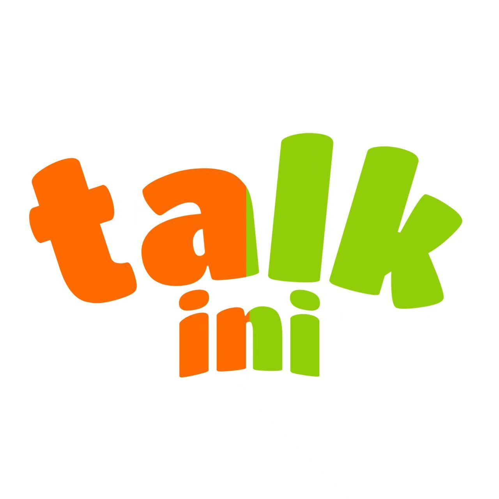

  
  <h1 style="margin: 0; font-size: 28px;">英语教材怎么选？课件推荐指南</h1>

> 💡 选教材看**孩子的英语水平**，不看年龄。同龄孩子基础可能差很多，选对难度比选对年龄更重要。

**难度参考：** ❤ 入门 → ❤❤ 基础 → ❤❤❤ 中级 → ❤❤❤❤ 中高级 → ❤❤❤❤❤ 高级

## 📌 选课建议速查表

> 根据孩子当前英语水平选择，而非年龄（针对外教口语课程）

| 当前水平 | 主课推荐 | 搭配阅读 |
|---------|---------|---------|
| **零基础**（不认识字母） | 牛津自然拼读、51Talk LK-L0、Sight Words | 小鼠波波、波西和皮普 |
| **字母基础**（认识字母、简单单词） | 牛津自然拼读、51Talk L1-L2、Everybody Up Starter、Sight Words L2-L3 | Heinemann G1、牛津阅读树 Stage 3-4、RAZ AA-C |
| **简单对话**（能说简单句子、日常对话） | 51Talk L3-L4、Everybody Up 2-3、Power UP 1、New Magic、Reach鲸鱼 G1 | Heinemann G2、牛津阅读树 Stage 5-6、RAZ D-G |
| **流利对话**（能较流利交流、简单阅读） | 51Talk L5-L6、Everybody Up 4-5、Power UP 2-3、Wonder Skills、小猪佩奇 | 牛津阅读树 Stage 7-9、RAZ H-K |
| **高级对话**（流利表达、能读短文） | 51Talk L7-L9、Power UP 4-5、Oxford Discover、Wonder Skills、Think、Side by Side、Free Talk | RAZ L-P、牛津阅读树 Stage 10-12、新概念1册 |
| **成人学习者** | 50天情景速成、成人经典英语、Travel English、Side by Side、商务英语 | |

---

## 一、启蒙阶段

> 适合刚刚启蒙或零基础的孩子

### 🔤 牛津自然拼读 Oxford Phonics World

**难度：❤**｜出版社：牛津大学出版社｜参考年龄：3-12岁

1. 牛津大学出版社经典教材，系统专业又层层递进，堪称最好的自然拼读教材
2. 靠"字母/字母组合发音规律"实现"见词能拼、听音能写"
3. 内容丰富，包含单词听读、书写、辨音、故事、歌曲、游戏
4. 分级清晰：入门→基础→进阶→应用，衔接拼读与阅读

> 📌 平台提供简洁版和多动画版两种课件可选

---

### 🐣 51Talk经典英语青少年系列

**难度：❤❤**｜参考年龄：3-16岁｜共10个级别（LK-L9）

1. 适合启蒙，每节课一个主题，涉及范围广
2. 内容循序渐进，画面活泼，能吸引小朋友注意力，非常适合中国宝宝体质
3. 科学分级体系：
   - **LK（启蒙预备级）**：听懂课堂指令，会说基础单词
   - **L0（零基础入门）**：26个字母认知，144个核心词汇
   - **L1-L3（初级）**：入门到简单应用，累计864个高频词汇
   - **L4-L6（中级）**：熟练应用与读写拓展，1296个词汇
   - **L7-L9（高级）**：学术冲刺，864个学术词汇+18个核心语法点

---

### 🐋 Reach鲸鱼教材

**难度：❤❤❤**｜出版社：国家地理学习｜共9个级别（PreK-G3）

1. 课件十分有趣，结合真实世界主题，会提高孩子的兴趣
2. 相对于前面2个教材，Reach鲸鱼难度稍微大一些，需要孩子上过一段课后再进行
3. PreK级别适合零基础孩子，通过故事、歌曲和游戏自然习得英语

---

### 📚 启蒙绘本系列

**难度：❤❤**｜参考年龄：2-6岁

平台还提供多套经典启蒙绘本课件：
- **波西和皮普《Pip and Posy》** — Axel Scheffler（《咕噜牛》作者）创作，围绕两个好朋友的日常小故事，语言简单重复，画风温暖，适合零基础磨耳朵和亲子共读
- **小鼠波波 Maisy** — Lucy Cousins经典低幼绘本，色彩鲜明、句式极简（每页1-2句），主题贴近幼儿生活（吃饭、睡觉、玩耍），是英语启蒙的"第一套绘本"首选
- **小饼干狗 Biscuit** — HarperCollins出版的I Can Read系列入门级，讲述小女孩和小狗Biscuit的温馨日常，句型反复出现（"Woof, woof!"），非常适合从绘本过渡到自主阅读
- **小猪小象 An Elephant & Piggie Book** — Mo Willems创作，以对话体为主，语言幽默夸张，表情丰富，特别适合练习口语语感和情绪表达，Guided Reading Level E-H

---

### 🔤 Sight Words 启蒙高频词

**难度：❤❤**｜参考年龄：幼儿园-一年级

1. 专为儿童英语启蒙设计的高频词学习资源，共5个级别（L1-L5）
2. 科学编排：按词汇出现频率和难度递进，从40个基础词汇到128个进阶词汇
3. 内容包含单词听读、书写、辨音、故事、歌曲、游戏

---

## 二、进阶阶段

> 适合有一定英语基础，需要系统提升的孩子

### 📦 Kid's Box 剑桥国际少儿英语

**难度：❤❤**｜出版社：剑桥大学出版社｜共7级（Starter-L6）｜参考年龄：4-12岁

1. 剑桥大学出版社专为非英语国家儿童出版的零起点英语教材
2. 内嵌KET、PET备考内容，注重词汇、语法等知识点，提升"听说读写"做题技巧
3. 含自然拼读（Phonics），结合歌曲、故事和游戏
4. 分级清晰：Starter（零基础入门）→ L1-L2（Starters水平）→ L3-L4（Movers-Flyers）→ L5-L6（衔接KET）

> 📌 平台提供第二版和第三版课件

---

### 🚀 剑桥 Power UP

**难度：❤❤❤**｜出版社：剑桥大学出版社｜共7级（0-6级）｜参考年龄：4-13岁

1. Kid's Box升级版，需要孩子有一定基础，后面级别难度比较大
2. 语法板块升级明显，还有大量跨学科教育（人文地理、自然科学、手工绘画等）
3. 阅读素材广泛，融合项目式学习（PBL）
4. 分级体系：
   - **0级（预备级）**：英语启蒙，26个字母+100+高频词
   - **1-2级（基础-进阶）**：日常句型与阅读理解
   - **3-4级（提升-强化）**：阅读策略与KET备考衔接
   - **5-6级（冲刺级）**：KET/PET高分突破，批判性思维

---

### 📖 Wonder Skills

**难度：❤❤❤**｜出版社：麦格劳·希尔｜5级分级（Starter-Master）｜参考年龄：6-15岁

1. 聚焦高频词、阅读、口语练习三个板块，非常清晰
2. 有配套练习册，利于孩子课后巩固，五个级别可延伸拓展
3. 阅读材料范围广，从人文地理到社会科学都包含
4. 适配中国孩子：先学单词句型再读文本，符合外语学习规律
5. 思维+应试双提升：搭配思维工具，同步中高考题型
6. 学完3级达KET、5级达PET水平，对应CEFR PreA1-Lower B2

---

### 🔍 Oxford Discover 牛津探索系列

**难度：❤❤❤**｜出版社：牛津大学出版社｜共7级（Foundation+L1-L6）｜参考年龄：5-14岁

1. 由老师引导学生学习学科知识，透过问题探索，培养批判思考及问题解决能力
2. 每个单元的文学及科普文本让孩子练习读写技巧
3. 语法板块比较清楚
4. 融合学科知识与语言学习，培养21世纪4C核心能力（批判性思维、沟通、协作、创新）
5. 覆盖CEFR A1-B2，衔接剑桥YLE、KET/PET及FCE考试

---

### 🎒 Everybody Up 牛津美式英语

**难度：❤❤❤**｜出版社：牛津大学出版社｜共7级（Starter+1-6级）｜参考年龄：5-13岁

1. 全球最强的儿童听说启蒙教材之一
2. 以歌曲、chant、故事和TPR动作课堂为核心，让孩子敢听、敢说、敢表达
3. 图大字少、句子简短、互动性强，非常适合作为孩子的英语第一套教材
4. 对应CEF国际语言标准Pre A1-B1级，覆盖2196个核心词汇
5. 与国内公立校教材匹配度高达89.23%

---

### 🎯 Let's Go 牛津经典少儿英语（第五版）

**难度：❤❤❤**｜出版社：牛津大学出版社｜参考年龄：6-12岁

1. 全球畅销儿童英语教材，通过歌曲、对话、自然拼读、游戏和情景练习学习
2. 内容主题贴近孩子生活，语言结构清晰、重复度高，便于理解和开口表达
3. 对应CEFR Pre-A1到A1水平

---

### 🌳 Oxford Reading Tree 牛津阅读树（跨阶段）

**难度：❤-❤❤❤❤**｜出版社：牛津大学出版社｜16级（Stage 1-16）｜参考年龄：3-14岁

1. 全球133个国家采用，英国家庭/学校首选启蒙教材
2. 围绕Biff一家+魔法钥匙冒险展开，连续剧式叙事，趣味性强
3. 拼读+阅读双轨：自然拼读训练与分级阅读结合
4. 从无字书→短句→章节书，循序渐进，1000+册读物
5. Stage 1-3 零基础启蒙，Stage 4-9 进阶提升，Stage 10+ 高阶拔高

---

### 📕 RAZ 分级阅读（跨阶段）

**难度：❤-❤❤❤❤**｜共29个级别（AA-Z2）｜参考年龄：幼儿园-高中

1. 美国经典分级阅读体系，从零基础到高中全覆盖
2. 分级体系：
   - **入门（AA-C）**：零基础，认单词、读短句
   - **基础（D-J）**：初级水平，词汇500-1500词
   - **进阶（K-P）**：中级水平，读300-800词文章
   - **高阶（Q-Z2）**：高级水平，2000+词，衔接学术英语

---

### 📗 Heinemann 海尼曼分级阅读（G0-G2）

**难度：❤❤**｜参考年龄：4-10岁

1. 专为儿童英语启蒙与早期阅读设计的分级绘本系列
2. 以简短句型和丰富插图为主，帮助孩子通过情境理解语言
3. 主题涵盖家庭、动物、学校、自然等生活场景

---

### ✨ New Magic 魔法英语

**难度：❤❤**｜参考年龄：幼儿园-初中（K1-K3 & G1-G9）

1. 香港朗文出版的小学英语主教材，香港超过80%小学采用，教学体系成熟
2. 以故事和任务驱动学习，每单元围绕一个主题展开，融合听说读写
3. 语法和词汇编排贴合亚洲孩子的学习节奏，比纯欧美教材更易上手
4. K1-K3为启蒙阶段，G1-G6为基础进阶，G7-G9衔接更高水平

---

### 🐷 小猪佩奇（1-4季）

**难度：❤❤❤**｜参考年龄：小学一年级及以上

1. 围绕佩奇一家生活场景展开，句式简短、表达自然
2. 四季难度递进：从基础听力→社交表达→情景表达→语篇理解
3. 第四季涉及科学、音乐、环保等内容，适合有一定基础的孩子

---

## 三、拔高阶段

> 适合有较好英语基础，需要学术能力提升的学生

### 🧠 Think 剑桥青少年英语

**难度：❤❤❤❤❤**｜出版社：剑桥大学出版社｜共6级（Starter-L5）

1. 相比国内课本，提供更多辅助理解词汇短语的精确练习（根据语境选词、连句等）
2. 除了主题重点词汇，还有很多非主题重点词汇，拓展孩子词汇量
3. 完全对应剑桥五级考试：KET、PET、FCE、CAE四个级别

> 📌 平台提供PDF版和PPT课件版

---

### 🌍 Wonders 美国小学英语

**难度：❤❤❤❤**｜出版社：麦格劳·希尔｜共7级（GK-G6）｜参考年龄：3-12岁

1. 全球首套对标美国共同核心州立标准（CCSS）的教材
2. 蓝思指数覆盖BR-1100L，对应CEFR PreA1-Lower B2
3. 包含18万阅读词汇，可衔接剑桥KET/PET、雅思、托福及中高考
4. 适合英语基础好、需同步美国课堂的孩子

---

### 📊 PM阅读系列（Wonder Skills扩展）

**难度：❤❤❤❤**｜共4级（Starter-Advanced）

1. 由Cengage Learning出版的经典分级阅读体系，全球广泛使用
2. 作为Wonder Skills的阅读扩展材料，提供大量配套阅读素材
3. 文本类型丰富：虚构故事、非虚构科普、诗歌等，培养多元阅读能力
4. 每个级别配有阅读理解练习，训练提取信息、推理判断等核心阅读技能

---

### 📐 New Round UP

**难度：❤❤❤**｜出版社：Pearson培生｜共7级（Starter-L6）｜参考年龄：6-16岁

1. 全球知名的语法专项训练教材，被誉为"语法练习圣经"
2. 每个语法点配有清晰的图表讲解+大量分层练习，从机械操练到灵活运用
3. 彩色插图和游戏化设计让语法学习不枯燥，低级别尤其适合小学生
4. 适合作为主教材的语法补充，搭配任何体系使用

---

### 📘 新概念英语（1-4册）

**难度：❤❤❤**｜参考年龄：小学高年级-成人

1. 经典英语教材，四册构成完整成长阶梯
2. 分册定位：
   - **第一册**：英语入门与启蒙，基础词汇与句型
   - **第二册**：夯实基础、建立语法框架（初中水平）
   - **第三册**：中级阶段，长句分析、逻辑表达（CEFR B1-B2）
   - **第四册**：高级英语运用与思辨表达（CEFR B2-C1）
3. 兼顾听说读写，英式英语表达自然优美

---

### 🌐 Look 国家地理少儿英语

**难度：❤❤-❤❤❤**｜出版社：国家地理学习｜共7级（Starter-L6）｜参考年龄：7-13岁

1. 通过真实世界图片、故事和视频引导孩子在语境中学习英语
2. 主题涵盖动物、家庭、自然、科技和文化
3. 语言难度从Pre-A1到B1，是从少儿英语向学术英语过渡的理想课程

---

### 🌏 Cambridge Global English 剑桥国际少儿英语

**难度：❤❤-❤❤❤**｜出版社：剑桥大学出版社｜共10级｜参考年龄：6-14岁

1. 融合阅读、听力、口语、写作和跨学科学习（CLIL）
2. 培养孩子的语言能力与全球视野
3. 语言难度从CEFR Pre-A1到B1+

---

### 📖 2000 Essential English Words

**难度：❤❤❤**｜共6册｜参考年龄：小学高年级-高中

1. 由词汇学专家Paul Nation编写，涵盖2000个最常用核心英语单词
2. 每册配有生动例句、短文阅读和练习，在语境中理解和运用词汇
3. 内容涉及日常生活、学校、健康、科技等主题

> 📌 平台提供PPT版和PDF版

---

### 📖 4000 Essential English Words

**难度：❤❤❤**｜共6册｜参考年龄：小学高年级-高中｜CEFR A2-B2

1. 同为Paul Nation编写，系统收录4000个核心单词
2. 每册约600-700个词汇，通过例句、短文和多样练习在语境中掌握
3. 是连接基础英语与流利表达的重要桥梁

---

### 🗣️ Side by Side

**难度：❤❤❤**｜共4册｜参考年龄：小学高年级-成人

1. 以真实沟通场景为核心的实用英语教材
2. 四册递进：零基础入门→初级进阶→中级→中高级
3. 注重口语表达与语法综合应用

---

### 🗣️ Free Talk 少儿定主题自由交谈

1. 开放式口语练习，围绕特定主题展开自由对话（如动物、旅行、学校生活等）
2. 没有固定课文，老师根据孩子水平灵活引导，重在"敢说"和"多说"
3. 适合有一定基础的孩子锻炼口语表达、临场反应和英语思维能力

---

## 四、成人/考试专区

### 💼 成人英语

- **成人经典英语1-13** — 51Talk成人课程，涵盖工作交流、商务会议、出国旅游等场景，CEFR A1-B2
- **50天英语情景速成** — 50个日常主题（问候、购物、点餐、看病等），短期口语突破的"开口神器"
- **Unlock 2e** — 剑桥大学出版社学术英语教材，以Discovery Education真实视频驱动学习，注重批判性思维和学术写作，CEFR A1-C1，适合大学生及备考雅思托福
- **剑桥商务英语 Business Vocabulary in Use** — 剑桥经典商务词汇工具书，按主题分类（会议、谈判、财务等），职场人士刚需
- **Business English 商务英语** — 商务沟通全场景课程
- **Travel English 旅行英语** — 出国旅行实用场景（机场、酒店、问路、点餐等），短期速成
- **Smile Daily 日常生活口语** — 轻松日常话题，适合零压力练口语
- **English Conversation 英语对话** — 以对话为核心的口语训练课程

### 📝 雅思备考

- **IELTS新雅思口语 5.5-6.5-7.5分** — 分层对比不同分数段回答范例，系统提升口语表达
- **雅思题库** — 口语真题题库，实战模拟练习
- **新东方100个句子记完7000个雅思单词** — 通过100个精选长难句覆盖7000核心词汇，高效速记

### 🎤 KET备考

- **KET口语秘籍** — 针对剑桥A2 Key考试口语部分，覆盖Part 1-2常见话题和答题技巧

### 💼 商务英语专区

- **Business Free Talk 商务版** — 商务场景自由交谈，模拟真实职场沟通
- **Business Travel English 海外商务差旅英语** — 出差场景专项（签证、商务宴请、展会等）
- **New Interview English 新面试英语** — 英语面试全流程训练（自我介绍、行为面试、薪资谈判等），高中毕业难度起
- **职场入门英语初级** — 职场新人必备，邮件、电话、会议等基础商务场景

### 📐 其他

- **加州数学** — 美国加州公立学校数学教材，全英文数学课程，适合想用英语学数学、备考国际学校的孩子
- **音标** — 国际音标系统学习，适合需要纠正发音的学生和成人

